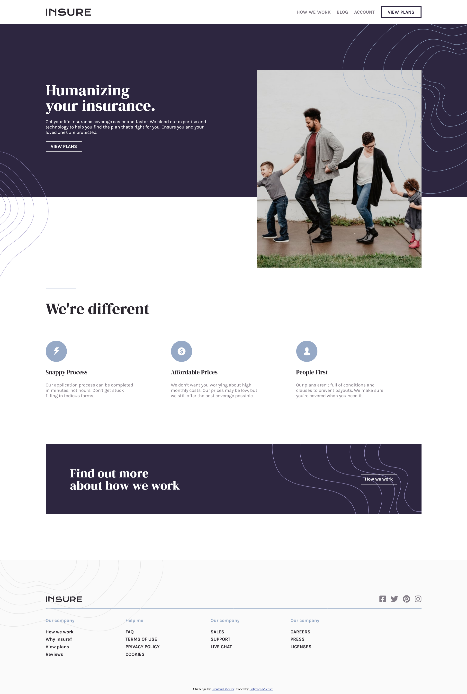

# Frontend Mentor - Insure landing page solution

This is a solution to the [Insure landing page challenge on Frontend Mentor](https://www.frontendmentor.io/challenges/insure-landing-page-uTU68JV8). Frontend Mentor challenges help you improve your coding skills by building realistic projects.

## Table of contents

- [Overview](#overview)
  - [The challenge](#the-challenge)
  - [Screenshot](#screenshot)
  - [Links](#links)
- [My process](#my-process)
  - [Built with](#built-with)
  - [What I learned](#what-i-learned)
  - [Continued development](#continued-development)
  - [Useful resources](#useful-resources)
- [Author](#author)

## Overview

### The challenge

Users should be able to:

- View the optimal layout for the site depending on their device's screen size
- See hover states for all interactive elements on the page

### Screenshot



### Links

- Solution URL: [Add solution URL here](https://your-solution-url.com)
- Live Site URL: [Add live site URL here](https://insure-fem-michaelx.netlify.app)

## My process

### Built with

- Semantic HTML5 markup
- CSS custom properties
- Flexbox
- CSS Grid
- JavaScript

### What I learned

I wouldn't say i've learnt it tho, but this project got me really interested in learning svg's and I am definitely going to learn it ASAP!!!... I also learnt a proficient yet simple method of navigating through image filepaths using Js.. I can't possibly go through all I learnt while creating this project, but in summary, I really appreciated creating this project as it has shown me some forms and methods of achieving different styles and functions I'd never thought of, some of which weren't even used in the project. I've written the js image filepath toggling function below. By the way, this is my first ever frontendmentor solution.

```js
image.onclick = () => {
	if (image.src.indexOf('filename-one') != -1) {
		image.src = 'filepath-2';
	} else {
		image.src = 'filepath-1';
	}
};
```

### Continued development

Svg, Semantic HTML, Markdown

### Useful resources

- [Font Awesome](https://fontawesome.com) - This helped me with my icons as i wasn't really comfortable using the provided svg's

- [Google Fonts](https://fonts.google.com) - This helped me get the fonts used in the project creation.

- [SVGATOR](https://www.svgator.com/) - This helped me create an open navigation svg for the mobile navbar as only a close toggle was provided and I had not learnt using svg or xml yet, so I wasn't able to edit the close toggle provided.

## Author

- Frontend Mentor - [@MichaelX-3553](https://www.frontendmentor.io/profile/MichaelX-3553)
